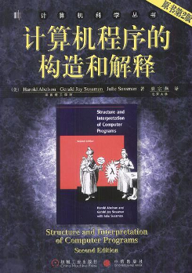

<!-- Generated By `npm run make` -->


# MY SICP ANSWERS

SICP 全称计算机程序的构造和解释，书上主要介绍了程序如何构造，以及程序是如何运行的，全书分 5 章，各章有不同的主题。

我的 SICP 习题册, 有些难的可能还没写出来 ^ ^ ，还要再推敲推敲, 本册子也可能随时弃坑。。。

# 刷题 Checklist

1. 偏数学的习题可以试着解一下，实在弄不来就先跳过（数学差，我恨）
2. 尽量独立得出结果，得出结果后我会去 https://sicp.readthedocs.io/en/latest/index.html 对一下答案看看是否一致 （目前发现几处地方我写的比较简洁 233）
3. 欢迎交流 ♂ 学习

# 使用说明

> We no longer support OS/2, DOS, or Windows.

此外，MIT/Scheme 目前不再支持 windows 了，在这里我用 racket 的 sicp 包来写书上的习题。关于 racket/sicp 可以参考：https://docs.racket-lang.org/sicp-manual/index.html

安装好 Racket 以及 sicp 包之后，还得设置一下系统 path 以确保命令行工具的使用。

全部都搞好以后可以用命令行工具运行本仓库的 `1 + 1` 例子:

``` bash 
$ racket ./1+1.rkt
```


# 目录

## 第 1 章 构造过程抽象 (共 33 题)

### [1.1.6 条件表达式和谓词](./src/%E7%AC%AC%201%20%E7%AB%A0%20%E6%9E%84%E9%80%A0%E8%BF%87%E7%A8%8B%E6%8A%BD%E8%B1%A1/1.1.6%20%E6%9D%A1%E4%BB%B6%E8%A1%A8%E8%BE%BE%E5%BC%8F%E5%92%8C%E8%B0%93%E8%AF%8D) 

> [习题 1.1](./src/%E7%AC%AC%201%20%E7%AB%A0%20%E6%9E%84%E9%80%A0%E8%BF%87%E7%A8%8B%E6%8A%BD%E8%B1%A1/1.1.6%20%E6%9D%A1%E4%BB%B6%E8%A1%A8%E8%BE%BE%E5%BC%8F%E5%92%8C%E8%B0%93%E8%AF%8D#%E4%B9%A0%E9%A2%98-11), [习题 1.2](./src/%E7%AC%AC%201%20%E7%AB%A0%20%E6%9E%84%E9%80%A0%E8%BF%87%E7%A8%8B%E6%8A%BD%E8%B1%A1/1.1.6%20%E6%9D%A1%E4%BB%B6%E8%A1%A8%E8%BE%BE%E5%BC%8F%E5%92%8C%E8%B0%93%E8%AF%8D#%E4%B9%A0%E9%A2%98-12), [习题 1.3](./src/%E7%AC%AC%201%20%E7%AB%A0%20%E6%9E%84%E9%80%A0%E8%BF%87%E7%A8%8B%E6%8A%BD%E8%B1%A1/1.1.6%20%E6%9D%A1%E4%BB%B6%E8%A1%A8%E8%BE%BE%E5%BC%8F%E5%92%8C%E8%B0%93%E8%AF%8D#%E4%B9%A0%E9%A2%98-13), [习题 1.4](./src/%E7%AC%AC%201%20%E7%AB%A0%20%E6%9E%84%E9%80%A0%E8%BF%87%E7%A8%8B%E6%8A%BD%E8%B1%A1/1.1.6%20%E6%9D%A1%E4%BB%B6%E8%A1%A8%E8%BE%BE%E5%BC%8F%E5%92%8C%E8%B0%93%E8%AF%8D#%E4%B9%A0%E9%A2%98-14), [习题 1.5](./src/%E7%AC%AC%201%20%E7%AB%A0%20%E6%9E%84%E9%80%A0%E8%BF%87%E7%A8%8B%E6%8A%BD%E8%B1%A1/1.1.6%20%E6%9D%A1%E4%BB%B6%E8%A1%A8%E8%BE%BE%E5%BC%8F%E5%92%8C%E8%B0%93%E8%AF%8D#%E4%B9%A0%E9%A2%98-15)

### [1.2.4 求幂](./src/%E7%AC%AC%201%20%E7%AB%A0%20%E6%9E%84%E9%80%A0%E8%BF%87%E7%A8%8B%E6%8A%BD%E8%B1%A1/1.2.4%20%E6%B1%82%E5%B9%82) 

> [习题 1.16](./src/%E7%AC%AC%201%20%E7%AB%A0%20%E6%9E%84%E9%80%A0%E8%BF%87%E7%A8%8B%E6%8A%BD%E8%B1%A1/1.2.4%20%E6%B1%82%E5%B9%82#%E4%B9%A0%E9%A2%98-116), [习题 1.17](./src/%E7%AC%AC%201%20%E7%AB%A0%20%E6%9E%84%E9%80%A0%E8%BF%87%E7%A8%8B%E6%8A%BD%E8%B1%A1/1.2.4%20%E6%B1%82%E5%B9%82#%E4%B9%A0%E9%A2%98-117), [习题 1.18](./src/%E7%AC%AC%201%20%E7%AB%A0%20%E6%9E%84%E9%80%A0%E8%BF%87%E7%A8%8B%E6%8A%BD%E8%B1%A1/1.2.4%20%E6%B1%82%E5%B9%82#%E4%B9%A0%E9%A2%98-118), [习题 1.19](./src/%E7%AC%AC%201%20%E7%AB%A0%20%E6%9E%84%E9%80%A0%E8%BF%87%E7%A8%8B%E6%8A%BD%E8%B1%A1/1.2.4%20%E6%B1%82%E5%B9%82#%E4%B9%A0%E9%A2%98-119)

### [1.2.5 最大公约数](./src/%E7%AC%AC%201%20%E7%AB%A0%20%E6%9E%84%E9%80%A0%E8%BF%87%E7%A8%8B%E6%8A%BD%E8%B1%A1/1.2.5%20%E6%9C%80%E5%A4%A7%E5%85%AC%E7%BA%A6%E6%95%B0) 

> [习题 1.22](./src/%E7%AC%AC%201%20%E7%AB%A0%20%E6%9E%84%E9%80%A0%E8%BF%87%E7%A8%8B%E6%8A%BD%E8%B1%A1/1.2.5%20%E6%9C%80%E5%A4%A7%E5%85%AC%E7%BA%A6%E6%95%B0#%E4%B9%A0%E9%A2%98-122), [习题 1.23](./src/%E7%AC%AC%201%20%E7%AB%A0%20%E6%9E%84%E9%80%A0%E8%BF%87%E7%A8%8B%E6%8A%BD%E8%B1%A1/1.2.5%20%E6%9C%80%E5%A4%A7%E5%85%AC%E7%BA%A6%E6%95%B0#%E4%B9%A0%E9%A2%98-123), [习题 1.24](./src/%E7%AC%AC%201%20%E7%AB%A0%20%E6%9E%84%E9%80%A0%E8%BF%87%E7%A8%8B%E6%8A%BD%E8%B1%A1/1.2.5%20%E6%9C%80%E5%A4%A7%E5%85%AC%E7%BA%A6%E6%95%B0#%E4%B9%A0%E9%A2%98-124), [1-22 ~ 1-24 中关于时间复杂度的思考](./src/%E7%AC%AC%201%20%E7%AB%A0%20%E6%9E%84%E9%80%A0%E8%BF%87%E7%A8%8B%E6%8A%BD%E8%B1%A1/1.2.5%20%E6%9C%80%E5%A4%A7%E5%85%AC%E7%BA%A6%E6%95%B0#1-22-~%201-24%20%E4%B8%AD%E5%85%B3%E4%BA%8E%E6%97%B6%E9%97%B4%E5%A4%8D%E6%9D%82%E5%BA%A6%E7%9A%84%E6%80%9D%E8%80%83), [习题 1.25](./src/%E7%AC%AC%201%20%E7%AB%A0%20%E6%9E%84%E9%80%A0%E8%BF%87%E7%A8%8B%E6%8A%BD%E8%B1%A1/1.2.5%20%E6%9C%80%E5%A4%A7%E5%85%AC%E7%BA%A6%E6%95%B0#%E4%B9%A0%E9%A2%98-125), [习题 1.26](./src/%E7%AC%AC%201%20%E7%AB%A0%20%E6%9E%84%E9%80%A0%E8%BF%87%E7%A8%8B%E6%8A%BD%E8%B1%A1/1.2.5%20%E6%9C%80%E5%A4%A7%E5%85%AC%E7%BA%A6%E6%95%B0#%E4%B9%A0%E9%A2%98-126)

### [1.3.1 过程作为参数](./src/%E7%AC%AC%201%20%E7%AB%A0%20%E6%9E%84%E9%80%A0%E8%BF%87%E7%A8%8B%E6%8A%BD%E8%B1%A1/1.3.1%20%E8%BF%87%E7%A8%8B%E4%BD%9C%E4%B8%BA%E5%8F%82%E6%95%B0) 

> [习题 1.29](./src/%E7%AC%AC%201%20%E7%AB%A0%20%E6%9E%84%E9%80%A0%E8%BF%87%E7%A8%8B%E6%8A%BD%E8%B1%A1/1.3.1%20%E8%BF%87%E7%A8%8B%E4%BD%9C%E4%B8%BA%E5%8F%82%E6%95%B0#%E4%B9%A0%E9%A2%98-129), [习题 1.30](./src/%E7%AC%AC%201%20%E7%AB%A0%20%E6%9E%84%E9%80%A0%E8%BF%87%E7%A8%8B%E6%8A%BD%E8%B1%A1/1.3.1%20%E8%BF%87%E7%A8%8B%E4%BD%9C%E4%B8%BA%E5%8F%82%E6%95%B0#%E4%B9%A0%E9%A2%98-130), [习题 1.31](./src/%E7%AC%AC%201%20%E7%AB%A0%20%E6%9E%84%E9%80%A0%E8%BF%87%E7%A8%8B%E6%8A%BD%E8%B1%A1/1.3.1%20%E8%BF%87%E7%A8%8B%E4%BD%9C%E4%B8%BA%E5%8F%82%E6%95%B0#%E4%B9%A0%E9%A2%98-131), [习题 1.32](./src/%E7%AC%AC%201%20%E7%AB%A0%20%E6%9E%84%E9%80%A0%E8%BF%87%E7%A8%8B%E6%8A%BD%E8%B1%A1/1.3.1%20%E8%BF%87%E7%A8%8B%E4%BD%9C%E4%B8%BA%E5%8F%82%E6%95%B0#%E4%B9%A0%E9%A2%98-132), [习题 1.33](./src/%E7%AC%AC%201%20%E7%AB%A0%20%E6%9E%84%E9%80%A0%E8%BF%87%E7%A8%8B%E6%8A%BD%E8%B1%A1/1.3.1%20%E8%BF%87%E7%A8%8B%E4%BD%9C%E4%B8%BA%E5%8F%82%E6%95%B0#%E4%B9%A0%E9%A2%98-133)

### [1.3.2 用lambda构造过程](./src/%E7%AC%AC%201%20%E7%AB%A0%20%E6%9E%84%E9%80%A0%E8%BF%87%E7%A8%8B%E6%8A%BD%E8%B1%A1/1.3.2%20%E7%94%A8lambda%E6%9E%84%E9%80%A0%E8%BF%87%E7%A8%8B) 

> [习题 1.34](./src/%E7%AC%AC%201%20%E7%AB%A0%20%E6%9E%84%E9%80%A0%E8%BF%87%E7%A8%8B%E6%8A%BD%E8%B1%A1/1.3.2%20%E7%94%A8lambda%E6%9E%84%E9%80%A0%E8%BF%87%E7%A8%8B#%E4%B9%A0%E9%A2%98-134)

### [1.3.3 过程作为一般性的方法](./src/%E7%AC%AC%201%20%E7%AB%A0%20%E6%9E%84%E9%80%A0%E8%BF%87%E7%A8%8B%E6%8A%BD%E8%B1%A1/1.3.3%20%E8%BF%87%E7%A8%8B%E4%BD%9C%E4%B8%BA%E4%B8%80%E8%88%AC%E6%80%A7%E7%9A%84%E6%96%B9%E6%B3%95) 

> [习题 1.35](./src/%E7%AC%AC%201%20%E7%AB%A0%20%E6%9E%84%E9%80%A0%E8%BF%87%E7%A8%8B%E6%8A%BD%E8%B1%A1/1.3.3%20%E8%BF%87%E7%A8%8B%E4%BD%9C%E4%B8%BA%E4%B8%80%E8%88%AC%E6%80%A7%E7%9A%84%E6%96%B9%E6%B3%95#%E4%B9%A0%E9%A2%98-135), [习题 1.36](./src/%E7%AC%AC%201%20%E7%AB%A0%20%E6%9E%84%E9%80%A0%E8%BF%87%E7%A8%8B%E6%8A%BD%E8%B1%A1/1.3.3%20%E8%BF%87%E7%A8%8B%E4%BD%9C%E4%B8%BA%E4%B8%80%E8%88%AC%E6%80%A7%E7%9A%84%E6%96%B9%E6%B3%95#%E4%B9%A0%E9%A2%98-136), [习题 1.37](./src/%E7%AC%AC%201%20%E7%AB%A0%20%E6%9E%84%E9%80%A0%E8%BF%87%E7%A8%8B%E6%8A%BD%E8%B1%A1/1.3.3%20%E8%BF%87%E7%A8%8B%E4%BD%9C%E4%B8%BA%E4%B8%80%E8%88%AC%E6%80%A7%E7%9A%84%E6%96%B9%E6%B3%95#%E4%B9%A0%E9%A2%98-137), [习题 1.38](./src/%E7%AC%AC%201%20%E7%AB%A0%20%E6%9E%84%E9%80%A0%E8%BF%87%E7%A8%8B%E6%8A%BD%E8%B1%A1/1.3.3%20%E8%BF%87%E7%A8%8B%E4%BD%9C%E4%B8%BA%E4%B8%80%E8%88%AC%E6%80%A7%E7%9A%84%E6%96%B9%E6%B3%95#%E4%B9%A0%E9%A2%98-138), [习题 1.39](./src/%E7%AC%AC%201%20%E7%AB%A0%20%E6%9E%84%E9%80%A0%E8%BF%87%E7%A8%8B%E6%8A%BD%E8%B1%A1/1.3.3%20%E8%BF%87%E7%A8%8B%E4%BD%9C%E4%B8%BA%E4%B8%80%E8%88%AC%E6%80%A7%E7%9A%84%E6%96%B9%E6%B3%95#%E4%B9%A0%E9%A2%98-139)

### [1.3.4 过程作为返回值](./src/%E7%AC%AC%201%20%E7%AB%A0%20%E6%9E%84%E9%80%A0%E8%BF%87%E7%A8%8B%E6%8A%BD%E8%B1%A1/1.3.4%20%E8%BF%87%E7%A8%8B%E4%BD%9C%E4%B8%BA%E8%BF%94%E5%9B%9E%E5%80%BC) 

> [习题 1.40](./src/%E7%AC%AC%201%20%E7%AB%A0%20%E6%9E%84%E9%80%A0%E8%BF%87%E7%A8%8B%E6%8A%BD%E8%B1%A1/1.3.4%20%E8%BF%87%E7%A8%8B%E4%BD%9C%E4%B8%BA%E8%BF%94%E5%9B%9E%E5%80%BC#%E4%B9%A0%E9%A2%98-140), [习题 1.41](./src/%E7%AC%AC%201%20%E7%AB%A0%20%E6%9E%84%E9%80%A0%E8%BF%87%E7%A8%8B%E6%8A%BD%E8%B1%A1/1.3.4%20%E8%BF%87%E7%A8%8B%E4%BD%9C%E4%B8%BA%E8%BF%94%E5%9B%9E%E5%80%BC#%E4%B9%A0%E9%A2%98-141), [习题 1.42](./src/%E7%AC%AC%201%20%E7%AB%A0%20%E6%9E%84%E9%80%A0%E8%BF%87%E7%A8%8B%E6%8A%BD%E8%B1%A1/1.3.4%20%E8%BF%87%E7%A8%8B%E4%BD%9C%E4%B8%BA%E8%BF%94%E5%9B%9E%E5%80%BC#%E4%B9%A0%E9%A2%98-142), [习题 1.43](./src/%E7%AC%AC%201%20%E7%AB%A0%20%E6%9E%84%E9%80%A0%E8%BF%87%E7%A8%8B%E6%8A%BD%E8%B1%A1/1.3.4%20%E8%BF%87%E7%A8%8B%E4%BD%9C%E4%B8%BA%E8%BF%94%E5%9B%9E%E5%80%BC#%E4%B9%A0%E9%A2%98-143), [习题 1.44](./src/%E7%AC%AC%201%20%E7%AB%A0%20%E6%9E%84%E9%80%A0%E8%BF%87%E7%A8%8B%E6%8A%BD%E8%B1%A1/1.3.4%20%E8%BF%87%E7%A8%8B%E4%BD%9C%E4%B8%BA%E8%BF%94%E5%9B%9E%E5%80%BC#%E4%B9%A0%E9%A2%98-144), [习题 1.45](./src/%E7%AC%AC%201%20%E7%AB%A0%20%E6%9E%84%E9%80%A0%E8%BF%87%E7%A8%8B%E6%8A%BD%E8%B1%A1/1.3.4%20%E8%BF%87%E7%A8%8B%E4%BD%9C%E4%B8%BA%E8%BF%94%E5%9B%9E%E5%80%BC#%E4%B9%A0%E9%A2%98-145), [习题 1.46](./src/%E7%AC%AC%201%20%E7%AB%A0%20%E6%9E%84%E9%80%A0%E8%BF%87%E7%A8%8B%E6%8A%BD%E8%B1%A1/1.3.4%20%E8%BF%87%E7%A8%8B%E4%BD%9C%E4%B8%BA%E8%BF%94%E5%9B%9E%E5%80%BC#%E4%B9%A0%E9%A2%98-146)

## 第 2 章 构造数据抽象 (共 53 题)

### [2.1.1 实例：有理数的算数运算](./src/%E7%AC%AC%202%20%E7%AB%A0%20%E6%9E%84%E9%80%A0%E6%95%B0%E6%8D%AE%E6%8A%BD%E8%B1%A1/2.1.1%20%E5%AE%9E%E4%BE%8B%EF%BC%9A%E6%9C%89%E7%90%86%E6%95%B0%E7%9A%84%E7%AE%97%E6%95%B0%E8%BF%90%E7%AE%97) 

> [习题 2.1](./src/%E7%AC%AC%202%20%E7%AB%A0%20%E6%9E%84%E9%80%A0%E6%95%B0%E6%8D%AE%E6%8A%BD%E8%B1%A1/2.1.1%20%E5%AE%9E%E4%BE%8B%EF%BC%9A%E6%9C%89%E7%90%86%E6%95%B0%E7%9A%84%E7%AE%97%E6%95%B0%E8%BF%90%E7%AE%97#%E4%B9%A0%E9%A2%98-21)

### [2.1.2 抽象屏障](./src/%E7%AC%AC%202%20%E7%AB%A0%20%E6%9E%84%E9%80%A0%E6%95%B0%E6%8D%AE%E6%8A%BD%E8%B1%A1/2.1.2%20%E6%8A%BD%E8%B1%A1%E5%B1%8F%E9%9A%9C) 

> [习题 2.2](./src/%E7%AC%AC%202%20%E7%AB%A0%20%E6%9E%84%E9%80%A0%E6%95%B0%E6%8D%AE%E6%8A%BD%E8%B1%A1/2.1.2%20%E6%8A%BD%E8%B1%A1%E5%B1%8F%E9%9A%9C#%E4%B9%A0%E9%A2%98-22), [习题 2.3](./src/%E7%AC%AC%202%20%E7%AB%A0%20%E6%9E%84%E9%80%A0%E6%95%B0%E6%8D%AE%E6%8A%BD%E8%B1%A1/2.1.2%20%E6%8A%BD%E8%B1%A1%E5%B1%8F%E9%9A%9C#%E4%B9%A0%E9%A2%98-23)

### [2.1.3 数据意味着什么](./src/%E7%AC%AC%202%20%E7%AB%A0%20%E6%9E%84%E9%80%A0%E6%95%B0%E6%8D%AE%E6%8A%BD%E8%B1%A1/2.1.3%20%E6%95%B0%E6%8D%AE%E6%84%8F%E5%91%B3%E7%9D%80%E4%BB%80%E4%B9%88) 

> [习题 2.4](./src/%E7%AC%AC%202%20%E7%AB%A0%20%E6%9E%84%E9%80%A0%E6%95%B0%E6%8D%AE%E6%8A%BD%E8%B1%A1/2.1.3%20%E6%95%B0%E6%8D%AE%E6%84%8F%E5%91%B3%E7%9D%80%E4%BB%80%E4%B9%88#%E4%B9%A0%E9%A2%98-24), [习题 2.5](./src/%E7%AC%AC%202%20%E7%AB%A0%20%E6%9E%84%E9%80%A0%E6%95%B0%E6%8D%AE%E6%8A%BD%E8%B1%A1/2.1.3%20%E6%95%B0%E6%8D%AE%E6%84%8F%E5%91%B3%E7%9D%80%E4%BB%80%E4%B9%88#%E4%B9%A0%E9%A2%98-25), [习题 2.6](./src/%E7%AC%AC%202%20%E7%AB%A0%20%E6%9E%84%E9%80%A0%E6%95%B0%E6%8D%AE%E6%8A%BD%E8%B1%A1/2.1.3%20%E6%95%B0%E6%8D%AE%E6%84%8F%E5%91%B3%E7%9D%80%E4%BB%80%E4%B9%88#%E4%B9%A0%E9%A2%98-26), [对 Church Number 的定义的思考](./src/%E7%AC%AC%202%20%E7%AB%A0%20%E6%9E%84%E9%80%A0%E6%95%B0%E6%8D%AE%E6%8A%BD%E8%B1%A1/2.1.3%20%E6%95%B0%E6%8D%AE%E6%84%8F%E5%91%B3%E7%9D%80%E4%BB%80%E4%B9%88#%E5%AF%B9-Church%20Number%20%E7%9A%84%E5%AE%9A%E4%B9%89%E7%9A%84%E6%80%9D%E8%80%83)

### [2.1.4 拓展练习：区间算数](./src/%E7%AC%AC%202%20%E7%AB%A0%20%E6%9E%84%E9%80%A0%E6%95%B0%E6%8D%AE%E6%8A%BD%E8%B1%A1/2.1.4%20%E6%8B%93%E5%B1%95%E7%BB%83%E4%B9%A0%EF%BC%9A%E5%8C%BA%E9%97%B4%E7%AE%97%E6%95%B0) 

> [习题 2.7](./src/%E7%AC%AC%202%20%E7%AB%A0%20%E6%9E%84%E9%80%A0%E6%95%B0%E6%8D%AE%E6%8A%BD%E8%B1%A1/2.1.4%20%E6%8B%93%E5%B1%95%E7%BB%83%E4%B9%A0%EF%BC%9A%E5%8C%BA%E9%97%B4%E7%AE%97%E6%95%B0#%E4%B9%A0%E9%A2%98-27), [习题 2.8](./src/%E7%AC%AC%202%20%E7%AB%A0%20%E6%9E%84%E9%80%A0%E6%95%B0%E6%8D%AE%E6%8A%BD%E8%B1%A1/2.1.4%20%E6%8B%93%E5%B1%95%E7%BB%83%E4%B9%A0%EF%BC%9A%E5%8C%BA%E9%97%B4%E7%AE%97%E6%95%B0#%E4%B9%A0%E9%A2%98-28), [习题 2.9](./src/%E7%AC%AC%202%20%E7%AB%A0%20%E6%9E%84%E9%80%A0%E6%95%B0%E6%8D%AE%E6%8A%BD%E8%B1%A1/2.1.4%20%E6%8B%93%E5%B1%95%E7%BB%83%E4%B9%A0%EF%BC%9A%E5%8C%BA%E9%97%B4%E7%AE%97%E6%95%B0#%E4%B9%A0%E9%A2%98-29), [习题 2.10](./src/%E7%AC%AC%202%20%E7%AB%A0%20%E6%9E%84%E9%80%A0%E6%95%B0%E6%8D%AE%E6%8A%BD%E8%B1%A1/2.1.4%20%E6%8B%93%E5%B1%95%E7%BB%83%E4%B9%A0%EF%BC%9A%E5%8C%BA%E9%97%B4%E7%AE%97%E6%95%B0#%E4%B9%A0%E9%A2%98-210), [习题 2.11](./src/%E7%AC%AC%202%20%E7%AB%A0%20%E6%9E%84%E9%80%A0%E6%95%B0%E6%8D%AE%E6%8A%BD%E8%B1%A1/2.1.4%20%E6%8B%93%E5%B1%95%E7%BB%83%E4%B9%A0%EF%BC%9A%E5%8C%BA%E9%97%B4%E7%AE%97%E6%95%B0#%E4%B9%A0%E9%A2%98-211), [习题 2.12](./src/%E7%AC%AC%202%20%E7%AB%A0%20%E6%9E%84%E9%80%A0%E6%95%B0%E6%8D%AE%E6%8A%BD%E8%B1%A1/2.1.4%20%E6%8B%93%E5%B1%95%E7%BB%83%E4%B9%A0%EF%BC%9A%E5%8C%BA%E9%97%B4%E7%AE%97%E6%95%B0#%E4%B9%A0%E9%A2%98-212), [习题 2.13](./src/%E7%AC%AC%202%20%E7%AB%A0%20%E6%9E%84%E9%80%A0%E6%95%B0%E6%8D%AE%E6%8A%BD%E8%B1%A1/2.1.4%20%E6%8B%93%E5%B1%95%E7%BB%83%E4%B9%A0%EF%BC%9A%E5%8C%BA%E9%97%B4%E7%AE%97%E6%95%B0#%E4%B9%A0%E9%A2%98-213), [习题 2.15](./src/%E7%AC%AC%202%20%E7%AB%A0%20%E6%9E%84%E9%80%A0%E6%95%B0%E6%8D%AE%E6%8A%BD%E8%B1%A1/2.1.4%20%E6%8B%93%E5%B1%95%E7%BB%83%E4%B9%A0%EF%BC%9A%E5%8C%BA%E9%97%B4%E7%AE%97%E6%95%B0#%E4%B9%A0%E9%A2%98-215), [习题 2.16 （警告：这个问题非常难）](./src/%E7%AC%AC%202%20%E7%AB%A0%20%E6%9E%84%E9%80%A0%E6%95%B0%E6%8D%AE%E6%8A%BD%E8%B1%A1/2.1.4%20%E6%8B%93%E5%B1%95%E7%BB%83%E4%B9%A0%EF%BC%9A%E5%8C%BA%E9%97%B4%E7%AE%97%E6%95%B0#%E4%B9%A0%E9%A2%98-216%20%EF%BC%88%E8%AD%A6%E5%91%8A%EF%BC%9A%E8%BF%99%E4%B8%AA%E9%97%AE%E9%A2%98%E9%9D%9E%E5%B8%B8%E9%9A%BE%EF%BC%89)

### [2.2.1 序列的表示](./src/%E7%AC%AC%202%20%E7%AB%A0%20%E6%9E%84%E9%80%A0%E6%95%B0%E6%8D%AE%E6%8A%BD%E8%B1%A1/2.2.1%20%E5%BA%8F%E5%88%97%E7%9A%84%E8%A1%A8%E7%A4%BA) 

> [习题 2.17](./src/%E7%AC%AC%202%20%E7%AB%A0%20%E6%9E%84%E9%80%A0%E6%95%B0%E6%8D%AE%E6%8A%BD%E8%B1%A1/2.2.1%20%E5%BA%8F%E5%88%97%E7%9A%84%E8%A1%A8%E7%A4%BA#%E4%B9%A0%E9%A2%98-217), [习题 2.18](./src/%E7%AC%AC%202%20%E7%AB%A0%20%E6%9E%84%E9%80%A0%E6%95%B0%E6%8D%AE%E6%8A%BD%E8%B1%A1/2.2.1%20%E5%BA%8F%E5%88%97%E7%9A%84%E8%A1%A8%E7%A4%BA#%E4%B9%A0%E9%A2%98-218), [习题 2.19](./src/%E7%AC%AC%202%20%E7%AB%A0%20%E6%9E%84%E9%80%A0%E6%95%B0%E6%8D%AE%E6%8A%BD%E8%B1%A1/2.2.1%20%E5%BA%8F%E5%88%97%E7%9A%84%E8%A1%A8%E7%A4%BA#%E4%B9%A0%E9%A2%98-219), [习题 2.20](./src/%E7%AC%AC%202%20%E7%AB%A0%20%E6%9E%84%E9%80%A0%E6%95%B0%E6%8D%AE%E6%8A%BD%E8%B1%A1/2.2.1%20%E5%BA%8F%E5%88%97%E7%9A%84%E8%A1%A8%E7%A4%BA#%E4%B9%A0%E9%A2%98-220), [习题 2.21](./src/%E7%AC%AC%202%20%E7%AB%A0%20%E6%9E%84%E9%80%A0%E6%95%B0%E6%8D%AE%E6%8A%BD%E8%B1%A1/2.2.1%20%E5%BA%8F%E5%88%97%E7%9A%84%E8%A1%A8%E7%A4%BA#%E4%B9%A0%E9%A2%98-221), [习题 2.22](./src/%E7%AC%AC%202%20%E7%AB%A0%20%E6%9E%84%E9%80%A0%E6%95%B0%E6%8D%AE%E6%8A%BD%E8%B1%A1/2.2.1%20%E5%BA%8F%E5%88%97%E7%9A%84%E8%A1%A8%E7%A4%BA#%E4%B9%A0%E9%A2%98-222), [习题 2.23](./src/%E7%AC%AC%202%20%E7%AB%A0%20%E6%9E%84%E9%80%A0%E6%95%B0%E6%8D%AE%E6%8A%BD%E8%B1%A1/2.2.1%20%E5%BA%8F%E5%88%97%E7%9A%84%E8%A1%A8%E7%A4%BA#%E4%B9%A0%E9%A2%98-223)

### [2.2.2 层次性结构](./src/%E7%AC%AC%202%20%E7%AB%A0%20%E6%9E%84%E9%80%A0%E6%95%B0%E6%8D%AE%E6%8A%BD%E8%B1%A1/2.2.2%20%E5%B1%82%E6%AC%A1%E6%80%A7%E7%BB%93%E6%9E%84) 

> [习题 2.24](./src/%E7%AC%AC%202%20%E7%AB%A0%20%E6%9E%84%E9%80%A0%E6%95%B0%E6%8D%AE%E6%8A%BD%E8%B1%A1/2.2.2%20%E5%B1%82%E6%AC%A1%E6%80%A7%E7%BB%93%E6%9E%84#%E4%B9%A0%E9%A2%98-224), [习题 2.25](./src/%E7%AC%AC%202%20%E7%AB%A0%20%E6%9E%84%E9%80%A0%E6%95%B0%E6%8D%AE%E6%8A%BD%E8%B1%A1/2.2.2%20%E5%B1%82%E6%AC%A1%E6%80%A7%E7%BB%93%E6%9E%84#%E4%B9%A0%E9%A2%98-225), [习题 2.26](./src/%E7%AC%AC%202%20%E7%AB%A0%20%E6%9E%84%E9%80%A0%E6%95%B0%E6%8D%AE%E6%8A%BD%E8%B1%A1/2.2.2%20%E5%B1%82%E6%AC%A1%E6%80%A7%E7%BB%93%E6%9E%84#%E4%B9%A0%E9%A2%98-226), [习题 2.27](./src/%E7%AC%AC%202%20%E7%AB%A0%20%E6%9E%84%E9%80%A0%E6%95%B0%E6%8D%AE%E6%8A%BD%E8%B1%A1/2.2.2%20%E5%B1%82%E6%AC%A1%E6%80%A7%E7%BB%93%E6%9E%84#%E4%B9%A0%E9%A2%98-227), [习题 2.28](./src/%E7%AC%AC%202%20%E7%AB%A0%20%E6%9E%84%E9%80%A0%E6%95%B0%E6%8D%AE%E6%8A%BD%E8%B1%A1/2.2.2%20%E5%B1%82%E6%AC%A1%E6%80%A7%E7%BB%93%E6%9E%84#%E4%B9%A0%E9%A2%98-228), [习题 2.29](./src/%E7%AC%AC%202%20%E7%AB%A0%20%E6%9E%84%E9%80%A0%E6%95%B0%E6%8D%AE%E6%8A%BD%E8%B1%A1/2.2.2%20%E5%B1%82%E6%AC%A1%E6%80%A7%E7%BB%93%E6%9E%84#%E4%B9%A0%E9%A2%98-229), [习题 2.30](./src/%E7%AC%AC%202%20%E7%AB%A0%20%E6%9E%84%E9%80%A0%E6%95%B0%E6%8D%AE%E6%8A%BD%E8%B1%A1/2.2.2%20%E5%B1%82%E6%AC%A1%E6%80%A7%E7%BB%93%E6%9E%84#%E4%B9%A0%E9%A2%98-230), [习题 2.31](./src/%E7%AC%AC%202%20%E7%AB%A0%20%E6%9E%84%E9%80%A0%E6%95%B0%E6%8D%AE%E6%8A%BD%E8%B1%A1/2.2.2%20%E5%B1%82%E6%AC%A1%E6%80%A7%E7%BB%93%E6%9E%84#%E4%B9%A0%E9%A2%98-231), [习题 2.32](./src/%E7%AC%AC%202%20%E7%AB%A0%20%E6%9E%84%E9%80%A0%E6%95%B0%E6%8D%AE%E6%8A%BD%E8%B1%A1/2.2.2%20%E5%B1%82%E6%AC%A1%E6%80%A7%E7%BB%93%E6%9E%84#%E4%B9%A0%E9%A2%98-232)

### [2.2.3 序列作为一种约定的界面](./src/%E7%AC%AC%202%20%E7%AB%A0%20%E6%9E%84%E9%80%A0%E6%95%B0%E6%8D%AE%E6%8A%BD%E8%B1%A1/2.2.3%20%E5%BA%8F%E5%88%97%E4%BD%9C%E4%B8%BA%E4%B8%80%E7%A7%8D%E7%BA%A6%E5%AE%9A%E7%9A%84%E7%95%8C%E9%9D%A2) 

> [习题 2.33](./src/%E7%AC%AC%202%20%E7%AB%A0%20%E6%9E%84%E9%80%A0%E6%95%B0%E6%8D%AE%E6%8A%BD%E8%B1%A1/2.2.3%20%E5%BA%8F%E5%88%97%E4%BD%9C%E4%B8%BA%E4%B8%80%E7%A7%8D%E7%BA%A6%E5%AE%9A%E7%9A%84%E7%95%8C%E9%9D%A2#%E4%B9%A0%E9%A2%98-233), [习题 2.34](./src/%E7%AC%AC%202%20%E7%AB%A0%20%E6%9E%84%E9%80%A0%E6%95%B0%E6%8D%AE%E6%8A%BD%E8%B1%A1/2.2.3%20%E5%BA%8F%E5%88%97%E4%BD%9C%E4%B8%BA%E4%B8%80%E7%A7%8D%E7%BA%A6%E5%AE%9A%E7%9A%84%E7%95%8C%E9%9D%A2#%E4%B9%A0%E9%A2%98-234), [习题 2.35](./src/%E7%AC%AC%202%20%E7%AB%A0%20%E6%9E%84%E9%80%A0%E6%95%B0%E6%8D%AE%E6%8A%BD%E8%B1%A1/2.2.3%20%E5%BA%8F%E5%88%97%E4%BD%9C%E4%B8%BA%E4%B8%80%E7%A7%8D%E7%BA%A6%E5%AE%9A%E7%9A%84%E7%95%8C%E9%9D%A2#%E4%B9%A0%E9%A2%98-235), [习题 2.36](./src/%E7%AC%AC%202%20%E7%AB%A0%20%E6%9E%84%E9%80%A0%E6%95%B0%E6%8D%AE%E6%8A%BD%E8%B1%A1/2.2.3%20%E5%BA%8F%E5%88%97%E4%BD%9C%E4%B8%BA%E4%B8%80%E7%A7%8D%E7%BA%A6%E5%AE%9A%E7%9A%84%E7%95%8C%E9%9D%A2#%E4%B9%A0%E9%A2%98-236), [习题 2.37](./src/%E7%AC%AC%202%20%E7%AB%A0%20%E6%9E%84%E9%80%A0%E6%95%B0%E6%8D%AE%E6%8A%BD%E8%B1%A1/2.2.3%20%E5%BA%8F%E5%88%97%E4%BD%9C%E4%B8%BA%E4%B8%80%E7%A7%8D%E7%BA%A6%E5%AE%9A%E7%9A%84%E7%95%8C%E9%9D%A2#%E4%B9%A0%E9%A2%98-237), [习题 2.38](./src/%E7%AC%AC%202%20%E7%AB%A0%20%E6%9E%84%E9%80%A0%E6%95%B0%E6%8D%AE%E6%8A%BD%E8%B1%A1/2.2.3%20%E5%BA%8F%E5%88%97%E4%BD%9C%E4%B8%BA%E4%B8%80%E7%A7%8D%E7%BA%A6%E5%AE%9A%E7%9A%84%E7%95%8C%E9%9D%A2#%E4%B9%A0%E9%A2%98-238), [习题 2.39](./src/%E7%AC%AC%202%20%E7%AB%A0%20%E6%9E%84%E9%80%A0%E6%95%B0%E6%8D%AE%E6%8A%BD%E8%B1%A1/2.2.3%20%E5%BA%8F%E5%88%97%E4%BD%9C%E4%B8%BA%E4%B8%80%E7%A7%8D%E7%BA%A6%E5%AE%9A%E7%9A%84%E7%95%8C%E9%9D%A2#%E4%B9%A0%E9%A2%98-239), [习题 2.40](./src/%E7%AC%AC%202%20%E7%AB%A0%20%E6%9E%84%E9%80%A0%E6%95%B0%E6%8D%AE%E6%8A%BD%E8%B1%A1/2.2.3%20%E5%BA%8F%E5%88%97%E4%BD%9C%E4%B8%BA%E4%B8%80%E7%A7%8D%E7%BA%A6%E5%AE%9A%E7%9A%84%E7%95%8C%E9%9D%A2#%E4%B9%A0%E9%A2%98-240), [习题 2.41](./src/%E7%AC%AC%202%20%E7%AB%A0%20%E6%9E%84%E9%80%A0%E6%95%B0%E6%8D%AE%E6%8A%BD%E8%B1%A1/2.2.3%20%E5%BA%8F%E5%88%97%E4%BD%9C%E4%B8%BA%E4%B8%80%E7%A7%8D%E7%BA%A6%E5%AE%9A%E7%9A%84%E7%95%8C%E9%9D%A2#%E4%B9%A0%E9%A2%98-241), [习题 2.42](./src/%E7%AC%AC%202%20%E7%AB%A0%20%E6%9E%84%E9%80%A0%E6%95%B0%E6%8D%AE%E6%8A%BD%E8%B1%A1/2.2.3%20%E5%BA%8F%E5%88%97%E4%BD%9C%E4%B8%BA%E4%B8%80%E7%A7%8D%E7%BA%A6%E5%AE%9A%E7%9A%84%E7%95%8C%E9%9D%A2#%E4%B9%A0%E9%A2%98-242)

### [2.3.1 引号](./src/%E7%AC%AC%202%20%E7%AB%A0%20%E6%9E%84%E9%80%A0%E6%95%B0%E6%8D%AE%E6%8A%BD%E8%B1%A1/2.3.1%20%E5%BC%95%E5%8F%B7) 

> [习题 2.53](./src/%E7%AC%AC%202%20%E7%AB%A0%20%E6%9E%84%E9%80%A0%E6%95%B0%E6%8D%AE%E6%8A%BD%E8%B1%A1/2.3.1%20%E5%BC%95%E5%8F%B7#%E4%B9%A0%E9%A2%98-253), [习题 2.54](./src/%E7%AC%AC%202%20%E7%AB%A0%20%E6%9E%84%E9%80%A0%E6%95%B0%E6%8D%AE%E6%8A%BD%E8%B1%A1/2.3.1%20%E5%BC%95%E5%8F%B7#%E4%B9%A0%E9%A2%98-254), [习题 2.55](./src/%E7%AC%AC%202%20%E7%AB%A0%20%E6%9E%84%E9%80%A0%E6%95%B0%E6%8D%AE%E6%8A%BD%E8%B1%A1/2.3.1%20%E5%BC%95%E5%8F%B7#%E4%B9%A0%E9%A2%98-255)

### [2.3.2 符号求导](./src/%E7%AC%AC%202%20%E7%AB%A0%20%E6%9E%84%E9%80%A0%E6%95%B0%E6%8D%AE%E6%8A%BD%E8%B1%A1/2.3.2%20%E7%AC%A6%E5%8F%B7%E6%B1%82%E5%AF%BC) 

> [2.3.2 符号求导](./src/%E7%AC%AC%202%20%E7%AB%A0%20%E6%9E%84%E9%80%A0%E6%95%B0%E6%8D%AE%E6%8A%BD%E8%B1%A1/2.3.2%20%E7%AC%A6%E5%8F%B7%E6%B1%82%E5%AF%BC#232-%E7%AC%A6%E5%8F%B7%E6%B1%82%E5%AF%BC), [习题 2.56](./src/%E7%AC%AC%202%20%E7%AB%A0%20%E6%9E%84%E9%80%A0%E6%95%B0%E6%8D%AE%E6%8A%BD%E8%B1%A1/2.3.2%20%E7%AC%A6%E5%8F%B7%E6%B1%82%E5%AF%BC#%E4%B9%A0%E9%A2%98-256), [习题 2.57](./src/%E7%AC%AC%202%20%E7%AB%A0%20%E6%9E%84%E9%80%A0%E6%95%B0%E6%8D%AE%E6%8A%BD%E8%B1%A1/2.3.2%20%E7%AC%A6%E5%8F%B7%E6%B1%82%E5%AF%BC#%E4%B9%A0%E9%A2%98-257), [习题 2.58](./src/%E7%AC%AC%202%20%E7%AB%A0%20%E6%9E%84%E9%80%A0%E6%95%B0%E6%8D%AE%E6%8A%BD%E8%B1%A1/2.3.2%20%E7%AC%A6%E5%8F%B7%E6%B1%82%E5%AF%BC#%E4%B9%A0%E9%A2%98-258)

### [2.3.3 实例：集合的表示](./src/%E7%AC%AC%202%20%E7%AB%A0%20%E6%9E%84%E9%80%A0%E6%95%B0%E6%8D%AE%E6%8A%BD%E8%B1%A1/2.3.3%20%E5%AE%9E%E4%BE%8B%EF%BC%9A%E9%9B%86%E5%90%88%E7%9A%84%E8%A1%A8%E7%A4%BA) 

> [2.3.3 实例：集合的表示](./src/%E7%AC%AC%202%20%E7%AB%A0%20%E6%9E%84%E9%80%A0%E6%95%B0%E6%8D%AE%E6%8A%BD%E8%B1%A1/2.3.3%20%E5%AE%9E%E4%BE%8B%EF%BC%9A%E9%9B%86%E5%90%88%E7%9A%84%E8%A1%A8%E7%A4%BA#233-%E5%AE%9E%E4%BE%8B%EF%BC%9A%E9%9B%86%E5%90%88%E7%9A%84%E8%A1%A8%E7%A4%BA), [习题 2.59](./src/%E7%AC%AC%202%20%E7%AB%A0%20%E6%9E%84%E9%80%A0%E6%95%B0%E6%8D%AE%E6%8A%BD%E8%B1%A1/2.3.3%20%E5%AE%9E%E4%BE%8B%EF%BC%9A%E9%9B%86%E5%90%88%E7%9A%84%E8%A1%A8%E7%A4%BA#%E4%B9%A0%E9%A2%98-259), [习题 2.60](./src/%E7%AC%AC%202%20%E7%AB%A0%20%E6%9E%84%E9%80%A0%E6%95%B0%E6%8D%AE%E6%8A%BD%E8%B1%A1/2.3.3%20%E5%AE%9E%E4%BE%8B%EF%BC%9A%E9%9B%86%E5%90%88%E7%9A%84%E8%A1%A8%E7%A4%BA#%E4%B9%A0%E9%A2%98-260), [习题 2.61](./src/%E7%AC%AC%202%20%E7%AB%A0%20%E6%9E%84%E9%80%A0%E6%95%B0%E6%8D%AE%E6%8A%BD%E8%B1%A1/2.3.3%20%E5%AE%9E%E4%BE%8B%EF%BC%9A%E9%9B%86%E5%90%88%E7%9A%84%E8%A1%A8%E7%A4%BA#%E4%B9%A0%E9%A2%98-261)

## 第 3 章 模块化、对象和状态 (共 5 题)

### [3.1.1 局部状态变量](./src/%E7%AC%AC%203%20%E7%AB%A0%20%E6%A8%A1%E5%9D%97%E5%8C%96%E3%80%81%E5%AF%B9%E8%B1%A1%E5%92%8C%E7%8A%B6%E6%80%81/3.1.1%20%E5%B1%80%E9%83%A8%E7%8A%B6%E6%80%81%E5%8F%98%E9%87%8F) 

> [3.1.1 局部状态变量](./src/%E7%AC%AC%203%20%E7%AB%A0%20%E6%A8%A1%E5%9D%97%E5%8C%96%E3%80%81%E5%AF%B9%E8%B1%A1%E5%92%8C%E7%8A%B6%E6%80%81/3.1.1%20%E5%B1%80%E9%83%A8%E7%8A%B6%E6%80%81%E5%8F%98%E9%87%8F#311-%E5%B1%80%E9%83%A8%E7%8A%B6%E6%80%81%E5%8F%98%E9%87%8F), [习题 3.1](./src/%E7%AC%AC%203%20%E7%AB%A0%20%E6%A8%A1%E5%9D%97%E5%8C%96%E3%80%81%E5%AF%B9%E8%B1%A1%E5%92%8C%E7%8A%B6%E6%80%81/3.1.1%20%E5%B1%80%E9%83%A8%E7%8A%B6%E6%80%81%E5%8F%98%E9%87%8F#%E4%B9%A0%E9%A2%98-31), [习题 3.2](./src/%E7%AC%AC%203%20%E7%AB%A0%20%E6%A8%A1%E5%9D%97%E5%8C%96%E3%80%81%E5%AF%B9%E8%B1%A1%E5%92%8C%E7%8A%B6%E6%80%81/3.1.1%20%E5%B1%80%E9%83%A8%E7%8A%B6%E6%80%81%E5%8F%98%E9%87%8F#%E4%B9%A0%E9%A2%98-32), [习题 3.3](./src/%E7%AC%AC%203%20%E7%AB%A0%20%E6%A8%A1%E5%9D%97%E5%8C%96%E3%80%81%E5%AF%B9%E8%B1%A1%E5%92%8C%E7%8A%B6%E6%80%81/3.1.1%20%E5%B1%80%E9%83%A8%E7%8A%B6%E6%80%81%E5%8F%98%E9%87%8F#%E4%B9%A0%E9%A2%98-33), [习题 3.4](./src/%E7%AC%AC%203%20%E7%AB%A0%20%E6%A8%A1%E5%9D%97%E5%8C%96%E3%80%81%E5%AF%B9%E8%B1%A1%E5%92%8C%E7%8A%B6%E6%80%81/3.1.1%20%E5%B1%80%E9%83%A8%E7%8A%B6%E6%80%81%E5%8F%98%E9%87%8F#%E4%B9%A0%E9%A2%98-34)

# make README.md 

``` bash
$ npm run make 
```

# 如何参与编辑

如果你觉得你习题 x.xx 解法更好，想提 PR，请在习题 x.xx 所在的 README.md 中的 `# 习题 x.xx` 段落之后之后写： 

``` markdown
... 其他内容

# 习题 x.xx
原本的解法

# 习题 x.xx @your_name
你的解法

```

修改完之后，请运行：

``` bash
$ npm i 
$ npm run make 
```

当然，也可以直接提 issues。

# License

MIT

 